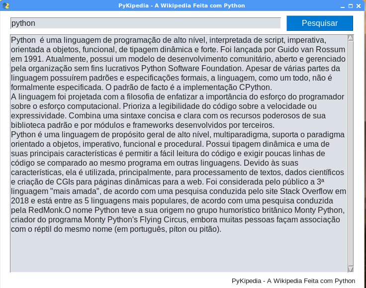

# PyKipedia---A-Wikipedia-Feita-com-Python

## Sobre o Software:

* Este software é feito inteiramente em python e usa as bibliotecas PySimpleGui e Wikipedia em suas entranhas.
* O PySimpleGui é usado para criar a interface gráfica...
* também usamos a API Wikipedia...
* O primeiro requisito é que seu computador tenha o Python que pode ser adquirido no link
[https://www.python.org/downloads/](https://www.python.org/downloads/)

## Download da PyKipedia

Baixe a pasta manualmente ou use o comando:
 
~~~python

git clone https://github.com/elizeubarbosaabreu/PyKipedia---A-Wikipedia-Feita-com-Python.git

~~~

## Preparando o ambiente de trabalho no Linux e MAC

Tendo o python em sua marca e também clonado o repositório, rode os comandos:
 
~~~python

cd PyKipedia---A-Wikipedia-Feita-com-Python
python3 -m venv .venv
source .venv/bin/activate
pip install -r requirements.txt

~~~

## Preparando o ambiente de trabalho no Windows

Ainda não teste o software no windows, mas pelo que sei os comandos são diferentes para a criação do ambiente virtual:

~~~python

cd PyKipedia---A-Wikipedia-Feita-com-Python
python -m venv .venv
source .venv\Scripts\activate.bat
pip install -r requirements.txt

~~~

## Executando o software

Agora rode o comando:
 
~~~python

python App.py

~~~

## Bônus: transformando a PyKipedia em Executável

Para transformar a PyKipedia em executável use a biblioteca [pyinstaller](https://pypi.org/project/pyinstaller/)...
Ainda dentro do ambiente de trabalho *.venv*, rode os comandos:
 
~~~python

pip install pyinstaller
pyinstaller App.py

~~~

O executável vai estar em uma pasta chamada **dist** basta renomeá-la para PyKipedia, fazer uma cópia dela para o local que quiser inclusive um pendrive e executar o arquivo executável **App**!

## Compartilhe o conhecimento!!!!